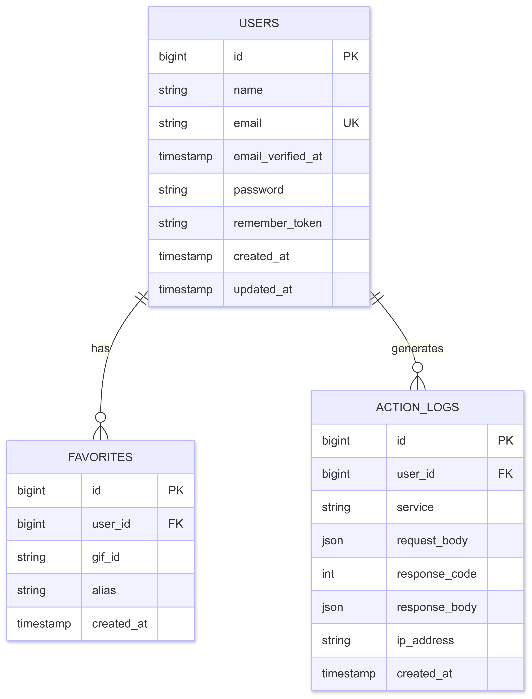
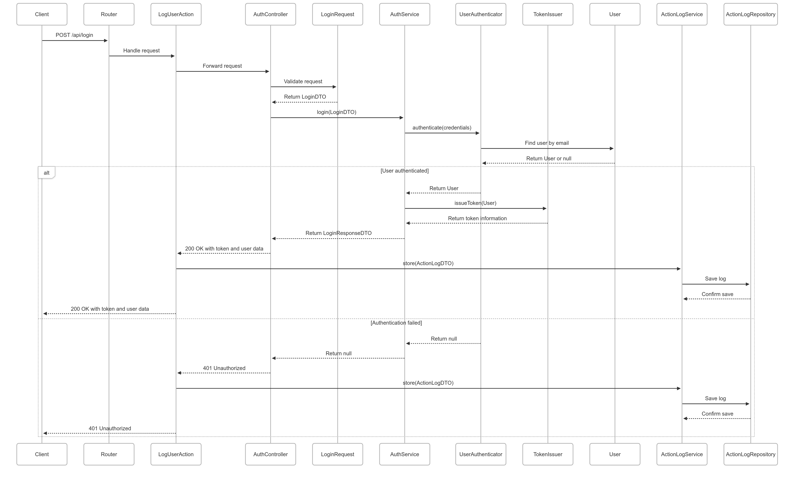
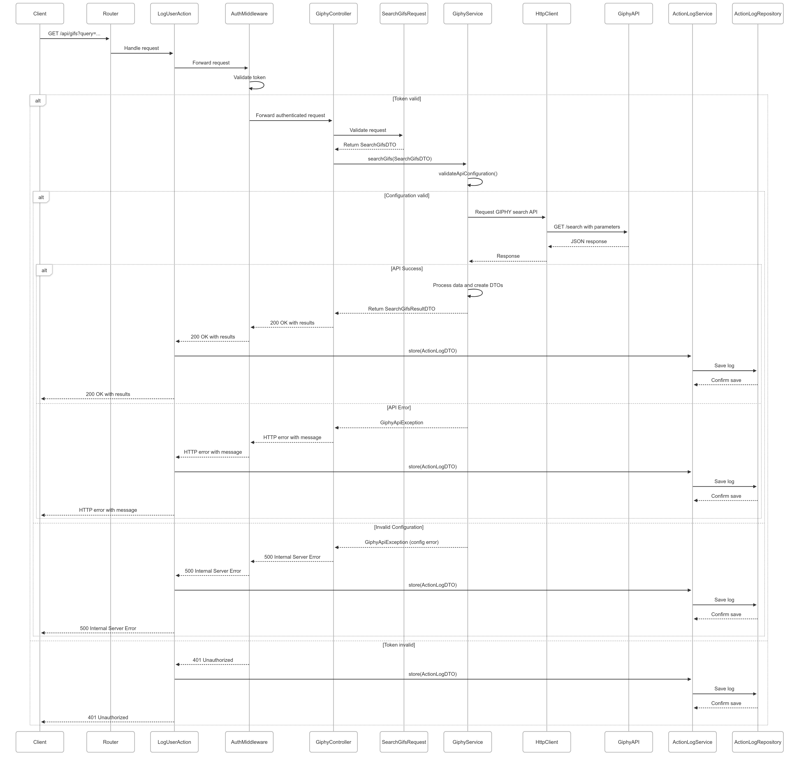
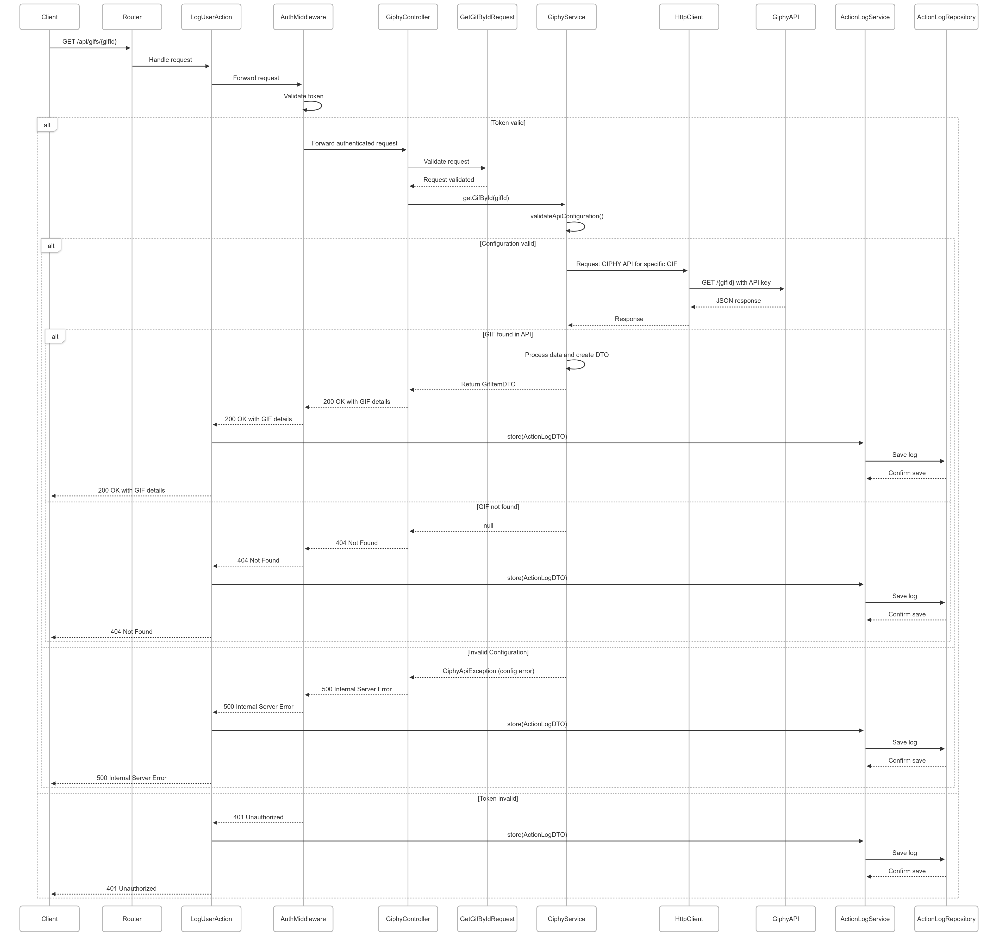
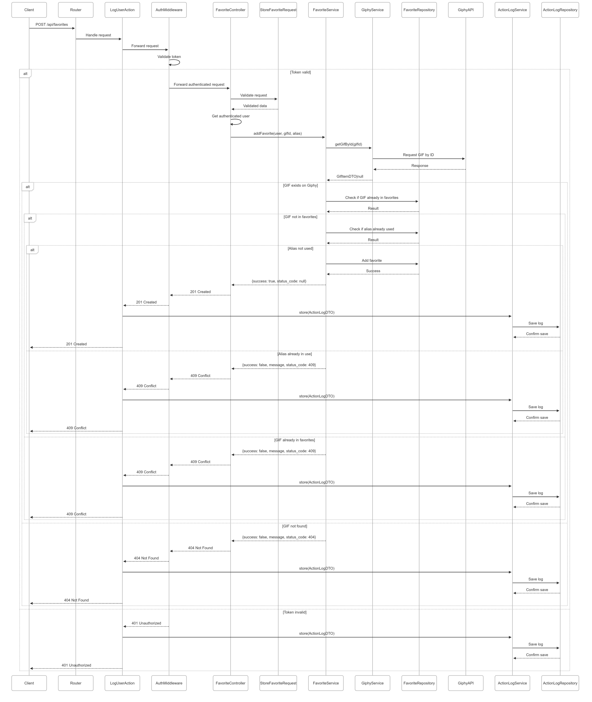
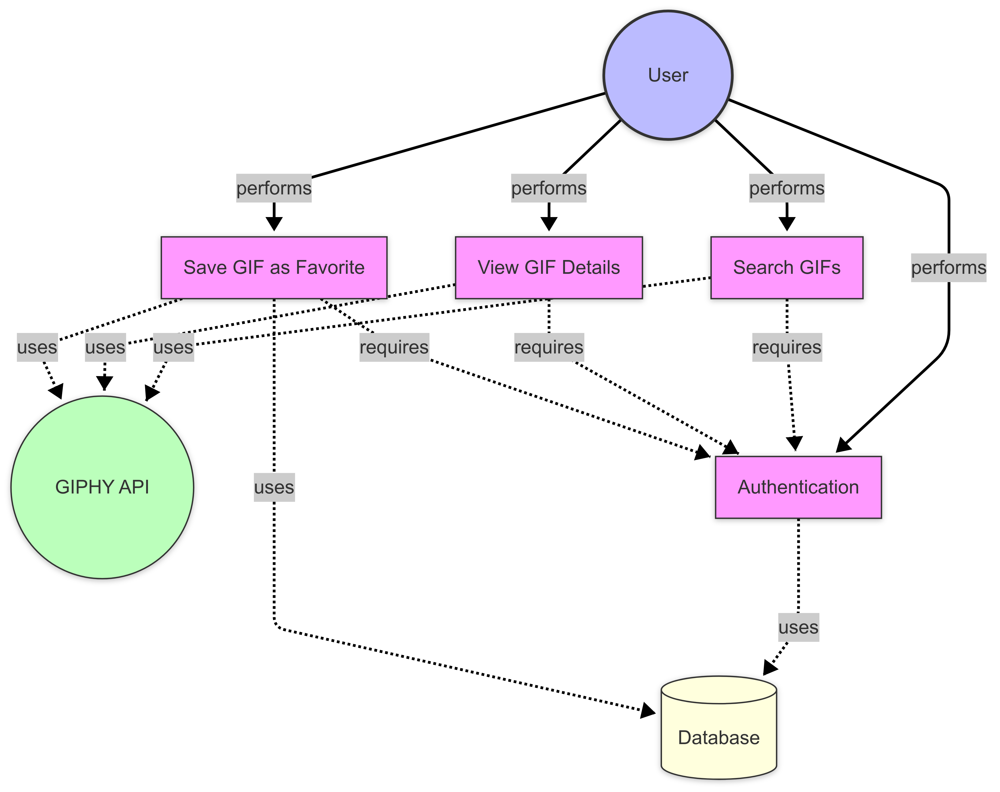
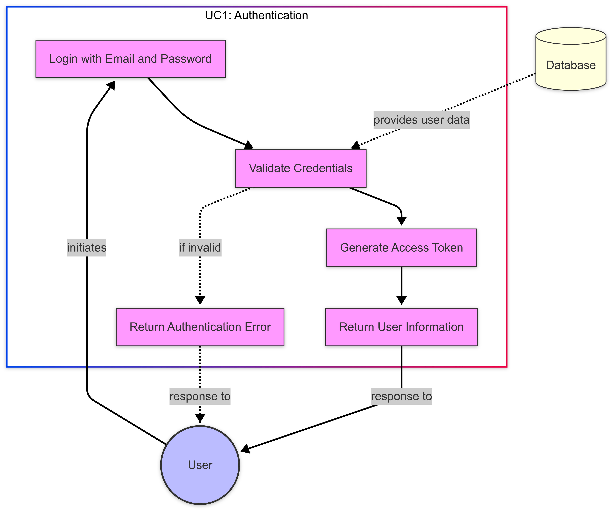
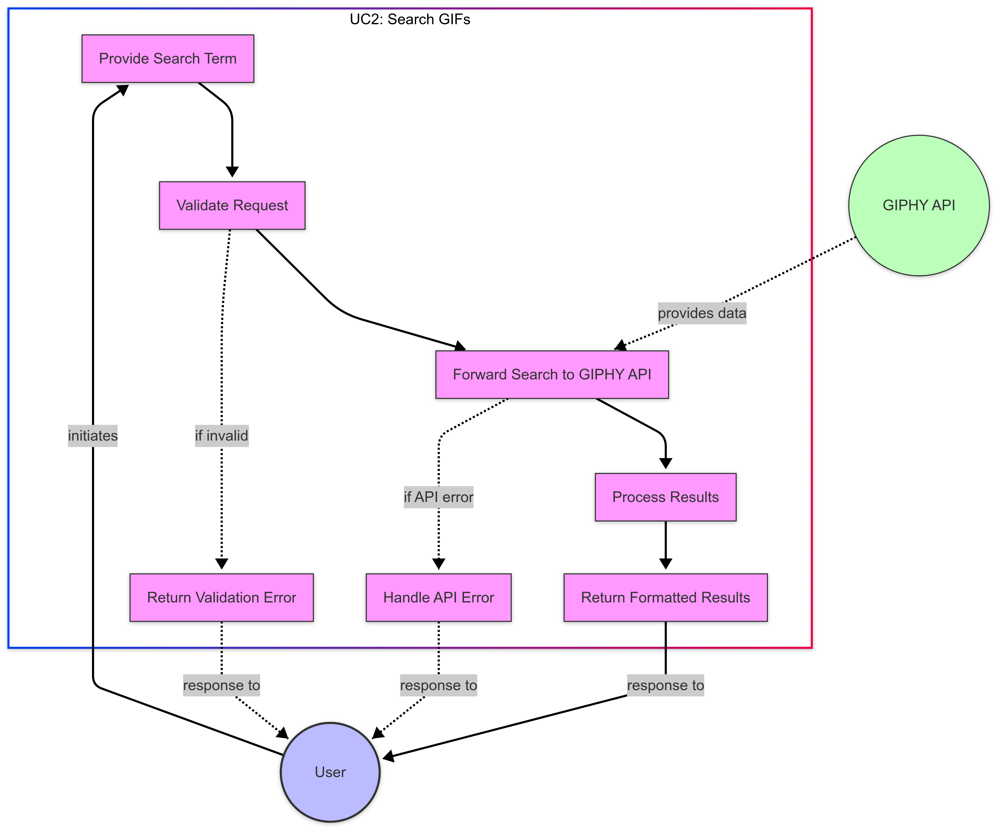
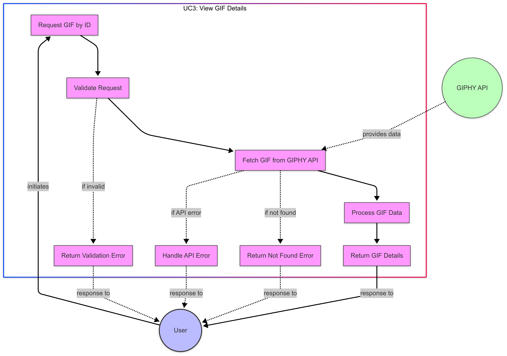
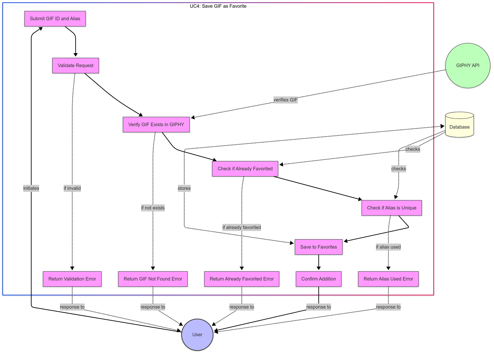

# Documentación del Proyecto

Este documento contiene todos los diagramas, gráficos y archivos de documentación del proyecto organizados por categorías.

## Archivos de Postman

Para facilitar las pruebas de la API, se proporcionan los siguientes archivos de Postman:

- **Collection de Postman**: Contiene todas las peticiones necesarias para probar los endpoints de la API.
  - [Descargar Collection](postman/PrexChallenge.postman_collection.json)

- **Environment de Postman**: Contiene las variables de entorno necesarias para las pruebas.
  - [Environment Local](postman/Prex%20Challenge%20(local).postman_environment.json)
  - [Environment Producción](postman/Prex%20Challenge%20(production).postman_environment.json)

### Instrucciones de uso

1. Descarga los archivos de Collection y Environment
2. Importa ambos archivos en Postman
3. Selecciona el environment "Prex Challenge" en Postman
4. Ejecuta primero el endpoint de login para obtener el token de autenticación
5. El resto de endpoints usarán automáticamente el token obtenido

## Diagrama de Entidad-Relación

Este diagrama muestra la estructura de la base de datos y las relaciones entre entidades.

## Diagramas de Secuencia

Estos diagramas muestran la interacción entre componentes del sistema para diferentes operaciones.

### Autenticación

### Búsqueda de GIFs

### Obtener GIF por ID

### Guardar GIF Favorito

## Diagramas de Casos de Uso

Estos diagramas ilustran las funcionalidades del sistema desde la perspectiva del usuario.

### Sistema Completo

### Autenticación

### Búsqueda de GIFs

### Ver Detalles de GIF

### Guardar GIF Favorito

